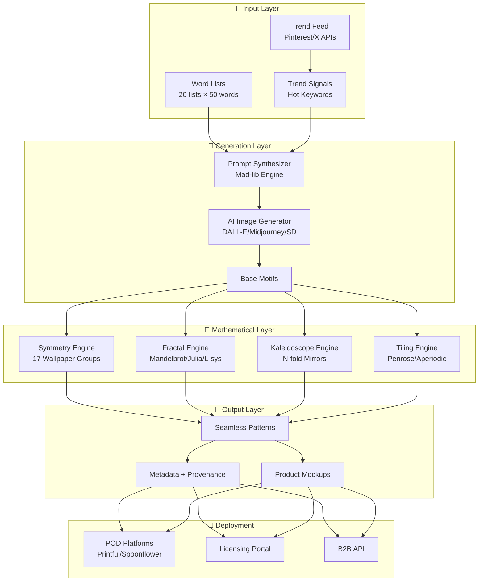

# Kaleidoscope: Infinite Pattern Generation System
## Executive Summary

---

## Vision Statement

**Kaleidoscope** is an autonomous, self-improving system that generates an infinite array of unique, commercially viable patterns by combining AI image generation with mathematical transformations. The system creates legally protectable designs suitable for fabric manufacturers, design studios, and print-on-demand marketplaces.

---

## Core Value Proposition

| Pillar | Description |
|--------|-------------|
| **Infinite Variety** | Mad-lib style prompt generation + mathematical transformations = unlimited unique patterns |
| **Legal Protection** | Human-authored mathematical formulas applied to AI content enables trademark protection |
| **Full Automation** | Scheduled generation, trend analysis, and deployment to sales channels |
| **Self-Improvement** | Feedback loops from sales data refine generation parameters |

---

## System Architecture Overview



---

## Mathematical Foundation Summary

### Wallpaper Symmetry Groups (17 Types)
Mathematically proven set of all possible 2D repeating patterns:
- **P1**: Translation only (oblique lattice)
- **P4M**: 4-fold rotation + mirrors (kaleidoscopic)
- **P6M**: 6-fold rotation + mirrors (honeycomb-like)

### Fractal Systems
- **Mandelbrot/Julia Sets**: `z_{n+1} = z_n² + c`
- **L-Systems**: Grammar-based growth patterns for organic forms

### Kaleidoscope Mathematics
- N-fold mirror reflections: `θ_k = 2πk/N` for k = 0..N-1
- Complex reflections: `z' = e^{2iθ}z̄`

---

## IP Protection Strategy

> [!IMPORTANT]
> **Key Legal Insight**: While purely AI-generated images lack copyright protection, the **mathematical transformation pipeline** and **human-authored algorithms** constitute sufficient human creative input to claim:
> 1. **Trademark protection** on distinctive patterns used in commerce
> 2. **Trade dress** for pattern families with recognizable aesthetic
> 3. **Trade secret** protection for the generation algorithms

### Documentation Requirements
- Full provenance chain from word seeds → AI output → transforms → final pattern
- Mathematical formula specifications as "authored works"
- Timestamp and versioning for priority claims

---

## Revenue Streams

| Channel | Model | Target |
|---------|-------|--------|
| **Print-on-Demand** | Per-sale royalty | Consumers |
| **Fabric Licensing** | Per-yard royalty | Manufacturers |
| **Design Subscriptions** | Monthly access | Studios/Agencies |
| **Custom Generation** | Per-pattern fee | Enterprise |
| **API Access** | Usage-based | Developers |

---

## Automation Schedule

```
┌─────────────────────────────────────────────────────────────┐
│  DAILY CYCLE (configurable time window)                    │
├─────────────────────────────────────────────────────────────┤
│  00:00  Trend Analysis (15 min)                            │
│         └─ Fetch trending keywords from Pinterest/X        │
│         └─ Update word list weightings                     │
│                                                             │
│  00:15  Pattern Generation (45 min, N patterns)            │
│         └─ Select word sequences                           │
│         └─ Generate prompts via LLM                        │
│         └─ Generate base images via AI                     │
│         └─ Apply mathematical transformations              │
│                                                             │
│  01:00  Quality Assurance (15 min)                         │
│         └─ Automated visual QA                             │
│         └─ Seamless tile verification                      │
│                                                             │
│  01:15  Deployment (30 min)                                │
│         └─ Generate mockups                                │
│         └─ Upload to POD platforms                         │
│         └─ Update catalog metadata                         │
└─────────────────────────────────────────────────────────────┘
```

---

## Key Differentiators

1. **Infinite Generative Capacity**: 20 word lists × 50 words × variable sampling = 10^30+ unique prompts
2. **Mathematical Rigor**: Based on proven group theory, not arbitrary transforms
3. **Legal Defensibility**: Clear provenance chain with human-authored mathematical layer
4. **Trend Responsiveness**: Real-time keyword integration from social feeds
5. **Full Automation**: Zero-touch generation to deployment pipeline

---

## Project Phases

| Phase | Duration | Deliverables |
|-------|----------|--------------|
| **1. Foundation** | 4 weeks | Core engine, word lists, basic transforms |
| **2. Integration** | 3 weeks | POD APIs, storage, scheduling |
| **3. Intelligence** | 3 weeks | Trend analysis, self-improvement loops |
| **4. Scale** | 2 weeks | Performance optimization, monitoring |
| **5. Launch** | 2 weeks | Beta testing, initial catalog |

**Total Estimated Timeline**: 14 weeks to MVP

---

## Success Metrics

- **Pattern Volume**: 100+ unique patterns/day capability
- **Sales Conversion**: >2% of uploaded patterns generate sales within 30 days
- **Trend Alignment**: 70%+ of generated patterns incorporate trending keywords
- **Quality Pass Rate**: 95%+ patterns pass automated QA
- **IP Portfolio**: 1000+ registered trademarks within first year

---

## Next Steps

1. ✅ Research phase complete
2. 🔄 Create detailed PRD with technical specifications
3. 📐 Document mathematical foundations with equations
4. 🏗️ Define project structure and agent architecture
5. 🔍 Conduct 20-phase adversarial validation
6. 📋 Finalize implementation plan for user approval

---

*Document Version: 1.0 | Created: 2024-12-07*
