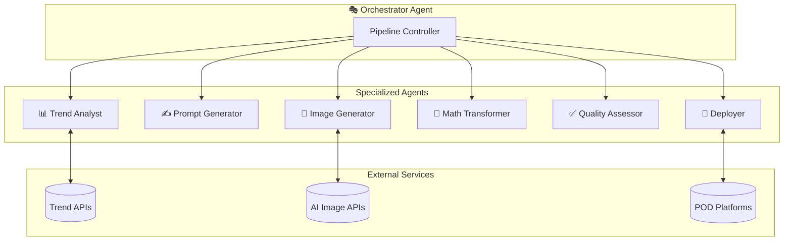

# Kaleidoscope: Agent Architecture & Workflows

---

## 1. Multi-Agent System Overview

The Kaleidoscope system employs a **multi-agent architecture** where specialized agents handle different aspects of the pattern generation pipeline.



---

## 2. Agent Definitions

### 2.1 Orchestrator Agent
**Purpose**: Coordinates the full generation pipeline, manages scheduling, and handles error recovery.

**Responsibilities**:
- Execute scheduled generation runs
- Sequence agent handoffs
- Monitor pipeline health
- Aggregate provenance data
- Handle failures and retries

**Trigger**: Cron schedule or manual invocation

---

### 2.2 Trend Analyst Agent
**Purpose**: Fetches and analyzes trending keywords to inform pattern generation.

**Input**: API credentials, target trend sources
**Output**: Weighted keyword list

**Process**:
1. Query Pinterest Trends API (fashion, design categories)
2. Query Twitter/X trending topics
3. Filter for pattern-relevant keywords
4. Score by velocity and relevance
5. Update trend cache with TTL

**Tools Used**:
- `pinterest_trends.py`
- `twitter_trends.py`

---

### 2.3 Prompt Generator Agent
**Purpose**: Creates evocative, unique prompts for AI image generation.

**Input**: 
- Weighted trend keywords
- Word lists (20 lists × 50+ words)
- Style preferences (optional)

**Output**: Structured prompt with metadata

**Process**:
1. Sample N words from word lists (weighted random)
2. Inject trending keywords (weighted by score)
3. Optionally bias toward cultural style
4. Compose final prompt via LLM
5. Log word selections for provenance

**Mad-Lib Algorithm**:
```python
def generate_prompt(word_lists, trend_keywords, style_bias=None):
    # Select random sample sizes per list
    selections = []
    for wl in word_lists:
        k = random.randint(1, 5)  # 1-5 words per list
        selections.extend(random.sample(wl, k))
    
    # Inject trending keywords
    trend_sample = weighted_sample(trend_keywords, n=3)
    selections.extend(trend_sample)
    
    # Add style bias if specified
    if style_bias:
        selections.append(f"in the style of {style_bias}")
    
    # Compose via LLM
    system = "You are a creative director. Combine these words into an evocative prompt for generating abstract pattern art."
    prompt = llm.compose(system, selections)
    
    return {
        'prompt': prompt,
        'word_seeds': selections,
        'style_bias': style_bias,
        'timestamp': now()
    }
```

---

### 2.4 Image Generator Agent
**Purpose**: Produces base images from prompts using AI image generation APIs.

**Input**: Structured prompt from Prompt Generator
**Output**: Base image(s) + generation metadata

**Supported Providers**:
- OpenAI DALL-E 3
- Stability AI Stable Diffusion
- Midjourney (via Discord automation)

**Process**:
1. Format prompt for target provider
2. Set generation parameters (size, quality, style)
3. Submit generation request
4. Poll for completion
5. Download and validate output
6. Extract color palette for metadata

---

### 2.5 Math Transformer Agent
**Purpose**: Applies mathematical transformations to create seamless patterns.

**Input**: Base image, transform specification
**Output**: Transformed pattern image

**Available Transforms**:
| Transform | Parameters |
|-----------|------------|
| Wallpaper Group | p1, pm, p4m, p6m, etc. |
| Kaleidoscope | N-fold (3-12) |
| Fractal Overlay | type, blend_mode, opacity |
| Tiling | penrose, wang, seamless |
| Color Shift | hue_rotate, palette_swap |

**Pipeline Pattern**:
```python
def transform_pipeline(image, specs):
    result = image
    for transform in specs:
        match transform['type']:
            case 'symmetry':
                result = apply_wallpaper_group(result, transform['group'])
            case 'kaleidoscope':
                result = apply_kaleidoscope(result, transform['folds'])
            case 'fractal':
                result = overlay_fractal(result, transform['fractal_type'])
            case 'tile':
                result = make_seamless(result, transform['method'])
    return result
```

---

### 2.6 Quality Assessor Agent
**Purpose**: Validates generated patterns meet quality standards.

**Input**: Transformed pattern image
**Output**: Quality score + pass/fail status

**Checks**:
1. **Seamless verification**: Edge continuity score
2. **Color balance**: No extreme saturation/brightness
3. **Complexity score**: Avoid too simple or too chaotic
4. **Resolution**: Meets minimum DPI requirements
5. **Artifact detection**: Compression artifacts, banding

**Thresholds**:
```yaml
quality_thresholds:
  seamless_score: 0.95
  complexity_range: [0.3, 0.8]
  min_resolution_dpi: 150
  max_artifact_score: 0.1
```

---

### 2.7 Deployer Agent
**Purpose**: Uploads approved patterns to POD platforms.

**Input**: Final pattern + metadata
**Output**: Platform listing URLs

**Platform Workflows**:

| Platform | Method | Automation Level |
|----------|--------|------------------|
| Printful | REST API | Full |
| Spoonflower | Web automation | Semi-automated |
| Redbubble | Selenium | Semi-automated |
| Custom Store | API | Full |

**Deployment Process**:
1. Generate product mockups
2. Prepare platform-specific metadata
3. Upload to each enabled platform
4. Capture listing URLs
5. Update catalog with deployment status

---

## 3. Workflow Definitions

### 3.1 Daily Generation Workflow

```yaml
# .agent/workflows/daily_generation.md
---
description: Automated daily pattern generation pipeline
schedule: "0 1 * * *"  # 1 AM daily
---

1. Trend Analysis (15 min)
   - Fetch Pinterest fashion/design trends
   - Fetch X/Twitter trending topics
   - Update keyword weights in cache

2. Prompt Generation (10 min)
   - Generate N prompts (default: 20)
   - Bias 30% toward trending keywords
   - Distribute across cultural styles

3. Image Generation (30 min)
   - Submit prompts to AI provider
   - Download base images
   - Extract color palettes

4. Mathematical Transforms (20 min)
   - Apply random transform chains
   - Ensure variety in symmetry types
   - Generate 2-3 variants per base

5. Quality Assurance (10 min)
   - Run automated checks
   - Flag failures for review
   - Pass ~95% expected rate

6. Deployment (15 min)
   - Generate mockups
   - Upload to enabled platforms
   - Update catalog database

7. Provenance Logging
   - Compute provenance hash
   - Store full generation chain
   - Archive to cold storage
```

### 3.2 On-Demand Generation Workflow

```yaml
# .agent/workflows/on_demand_generation.md
---
description: Generate patterns with specific parameters
trigger: manual
---

Input Parameters:
  - style_bias: Cultural style to emphasize
  - color_palette: Specific colors to incorporate
  - symmetry_type: Preferred wallpaper group
  - count: Number of patterns to generate

1. Parse and validate parameters
2. Configure prompt generator with biases
3. Execute generation pipeline
4. Return pattern IDs and preview URLs
```

---

## 4. Agent Communication Protocol

**Message Format**:
```json
{
  "from": "prompt_generator",
  "to": "image_generator",
  "type": "task",
  "payload": {
    "prompt": "...",
    "word_seeds": ["..."],
    "metadata": {}
  },
  "correlation_id": "uuid",
  "timestamp": "iso8601"
}
```

**State Machine**:
```
PENDING → PROCESSING → COMPLETED
              ↓
           FAILED → RETRY (max 3)
              ↓
           DEAD_LETTER
```

---

## 5. Self-Improvement Loop

**Feedback Signals**:
- Sales data from POD platforms
- Click-through rates on listings
- User favorites/saves

**Adaptation Mechanism**:
1. Aggregate performance by style/keywords
2. Increase weight for high-performing attributes
3. Decrease weight for underperformers
4. Update word list weights weekly

```python
def update_weights(performance_data):
    for item in performance_data:
        if item['sales'] > threshold:
            increase_weight(item['style'], 1.2)
            increase_weight(item['keywords'], 1.1)
        elif item['sales'] == 0 and item['days_listed'] > 30:
            decrease_weight(item['style'], 0.9)
```

---

*Agent Architecture v1.0*
