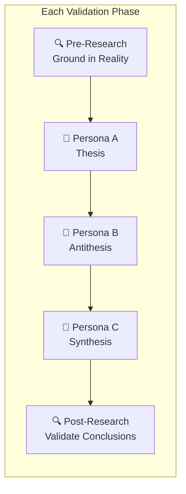

# Kaleidoscope: Adversarial Validation Framework
## 20-Phase Multi-Persona Council Validation

---

## 1. Framework Overview

This document defines the **adversarial validation methodology** used to validate all aspects of the Kaleidoscope system. The framework employs a 10-persona council engaged in 3-way conversations across 20 validation phases.

### Validation Structure
- **10 Personas**: Diverse expert perspectives
- **3-Way Conversations**: Thesis → Antithesis → Synthesis
- **20 Phases**: Comprehensive coverage of all system aspects
- **Grounding**: Web research before and after each validation phase



---

## 2. The 10 Personas

| ID | Persona | Expertise | Role in Validation |
|----|---------|-----------|-------------------|
| **P1** | **The Entrepreneur** | Startup strategy, market fit, monetization | Business viability |
| **P2** | **The Mathematician** | Group theory, fractals, topology | Mathematical rigor |
| **P3** | **The Artist** | Visual design, aesthetics, creativity | Artistic validity |
| **P4** | **The Engineer** | Systems architecture, scalability | Technical feasibility |
| **P5** | **The IP Attorney** | Copyright, trademark, patent law | Legal protection |
| **P6** | **The Skeptic** | Critical analysis, failure modes | Stress testing |
| **P7** | **The Cultural Historian** | Art history, cultural sensitivity | Cultural appropriateness |
| **P8** | **The Data Scientist** | ML/AI systems, trend analysis | AI/ML validity |
| **P9** | **The UX Designer** | User experience, automation UX | Workflow usability |
| **P10** | **The Ethicist** | AI ethics, creator rights, fairness | Ethical considerations |

---

## 3. Conversation Structure

Each validation phase follows this pattern:

### Step 1: Pre-Research Grounding
```
Query relevant sources to establish factual baseline:
- Academic papers
- Industry reports  
- Legal precedents
- Market data
- Technical documentation
```

### Step 2: Three-Way Dialogue

**Turn 1 - Thesis (Persona A)**
"From my perspective as [ROLE], I believe [ASPECT] is valid because..."

**Turn 2 - Antithesis (Persona B)**
"I challenge that view. As [ROLE], I see these risks/flaws..."

**Turn 3 - Synthesis (Persona C)**
"Considering both perspectives, the balanced conclusion is..."

### Step 3: Post-Research Validation
```
Verify synthesis conclusions against:
- Real-world examples
- Counter-examples
- Edge cases
- Implementation precedents
```

---

## 4. The 20 Validation Phases

### Phases 1-4: Core Concept Validation

| Phase | Focus | Personas | Key Questions |
|-------|-------|----------|---------------|
| **1** | Value Proposition | P1, P6, P3 | Is infinite pattern generation valuable? Who pays for this? |
| **2** | Market Fit | P1, P7, P9 | Do fabric manufacturers actually need this? What alternatives exist? |
| **3** | Originality Claim | P3, P5, P6 | Is combining AI + math transformations truly novel? Prior art? |
| **4** | Infinite = Quality? | P3, P6, P2 | Does quantity translate to quality? What's the curation strategy? |

### Phases 5-8: Technical Feasibility

| Phase | Focus | Personas | Key Questions |
|-------|-------|----------|---------------|
| **5** | AI Image Quality | P4, P8, P3 | Do current AI models produce pattern-suitable images? Resolution? |
| **6** | Seamless Tiling | P2, P4, P6 | Can mathematical transforms guarantee true seamless tiles? Edge cases? |
| **7** | Automation Reliability | P4, P9, P6 | Can pipeline run unattended? Failure modes? Recovery strategies? |
| **8** | Scalability | P4, P1, P8 | 100 patterns/day? 10,000? What breaks at scale? |

### Phases 9-12: Legal & IP Strategy

| Phase | Focus | Personas | Key Questions |
|-------|-------|----------|---------------|
| **9** | AI Copyright Position | P5, P10, P6 | Is the "math layer" claim defensible? What do courts say? |
| **10** | Trademark Viability | P5, P1, P6 | Can patterns really be trademarked? Distinctiveness requirements? |
| **11** | Training Data Liability | P5, P10, P8 | What if AI model trained on copyrighted patterns? Exposure? |
| **12** | Cultural Appropriation | P7, P10, P5 | Using cultural styles (Celtic, Japanese, etc.) — risks? Sensitivity? |

### Phases 13-16: Business Model

| Phase | Focus | Personas | Key Questions |
|-------|-------|----------|---------------|
| **13** | POD Economics | P1, P4, P6 | Unit economics at scale? Royalty rates? Margin analysis? |
| **14** | B2B Licensing | P1, P5, P9 | How do fabric mills actually license patterns? Pricing models? |
| **15** | Trend System ROI | P1, P8, P6 | Does trend integration actually increase sales? Cost/benefit? |
| **16** | Competition | P1, P6, P3 | Who else does this? What's the defensible moat? |

### Phases 17-20: Implementation Approach

| Phase | Focus | Personas | Key Questions |
|-------|-------|----------|---------------|
| **17** | MVP Definition | P4, P1, P9 | What's the minimal viable system? What can be cut? |
| **18** | Build vs Buy | P4, P1, P6 | Which components to build custom vs use existing services? |
| **19** | Self-Improvement Loop | P8, P4, P6 | Is the feedback loop realistic? Data requirements? |
| **20** | Launch Strategy | P1, P9, P3 | How to get first customers? Chicken-egg of catalog size? |

---

## 5. Validation Phase Template

### Phase [N]: [Topic]

#### Pre-Research
```
Sources consulted:
- [Source 1]: [Key finding]
- [Source 2]: [Key finding]
- [Source 3]: [Key finding]
```

#### Dialogue

**[Persona A] - Thesis:**
> [Statement supporting the aspect]

**[Persona B] - Antithesis:**
> [Counter-argument or risk identification]

**[Persona C] - Synthesis:**
> [Balanced resolution incorporating both views]

#### Post-Research Validation
```
Reality check:
- [Finding 1]: Supports/Challenges synthesis
- [Finding 2]: Supports/Challenges synthesis
- [Real-world example/precedent]
```

#### Phase Conclusions
- ✅ **Validated**: [Aspect]
- ⚠️ **Risk Identified**: [Risk + mitigation]
- ❌ **Invalidated**: [Aspect to revise]
- 📋 **Action Items**: [Required changes]

---

## 6. Aggregated Validation Criteria

### Must Pass (No ❌)
- Core value proposition
- Legal defensibility
- Technical feasibility of MVP
- Ethical clearance

### Should Address (⚠️ Mitigated)
- Scalability concerns
- Economic viability edge cases
- Cultural sensitivity issues

### Nice to Validate (Context-Dependent)
- Self-improvement effectiveness
- Trend prediction accuracy
- Long-term market position

---

## 7. Validation Output Format

After completing all 20 phases, produce:

### Validation Summary Report
```markdown
# Kaleidoscope Adversarial Validation Report

## Overall Status: [PASS / CONDITIONAL PASS / FAIL]

## Phase Results Summary
| Phase | Topic | Status | Key Finding |
|-------|-------|--------|-------------|
| 1 | Value Proposition | ✅ | [Summary] |
| 2 | Market Fit | ⚠️ | [Summary + mitigation] |
...

## Critical Risks Identified
1. [Risk]: [Mitigation plan]
2. [Risk]: [Mitigation plan]

## Required Plan Modifications
1. [Change to implementation plan]
2. [Change to implementation plan]

## Strengths Validated
1. [Validated strength]
2. [Validated strength]

## Recommended Next Steps
1. [Action]
2. [Action]
```

---

## 8. Execution Cadence

For comprehensive validation:
- **Phases 1-4**: Day 1 (Core concepts)
- **Phases 5-8**: Day 2 (Technical)
- **Phases 9-12**: Day 3 (Legal/IP)
- **Phases 13-16**: Day 4 (Business)
- **Phases 17-20**: Day 5 (Implementation)
- **Synthesis Report**: Day 6

---

*Adversarial Validation Framework v1.0*
