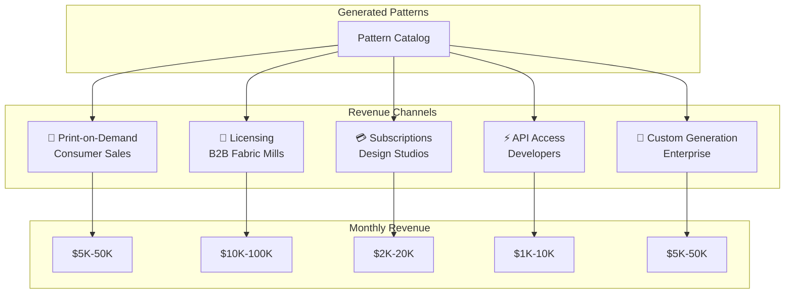

# Kaleidoscope: Monetization Strategy

---

## 1. Revenue Stream Overview



---

## 2. Channel Details

### 2.1 Print-on-Demand (POD)

**Platforms:**
| Platform | Products | Royalty | Automation |
|----------|----------|---------|------------|
| **Printful** | Apparel, home goods | 15-30% | Full API |
| **Spoonflower** | Fabric, wallpaper | 10-15% | Semi-automated |
| **Redbubble** | Stickers, cases, art | 10-25% | Selenium |
| **Society6** | Art prints, furniture | 10-15% | Manual |
| **Zazzle** | Everything | 5-25% | API available |

**Revenue Model:**
```
POD Revenue = Σ(patterns × views × conversion_rate × price × royalty_rate)

Example:
- 1,000 patterns uploaded
- Average 50 views/pattern/month = 50,000 views
- 0.5% conversion rate = 250 sales
- $30 average price × 15% royalty = $4.50/sale
- Monthly: $1,125
- Scaling to 10,000 patterns: $11,250/month
```

**Key Metrics:**
- Upload velocity: 50-100 patterns/week
- Time to first sale: 2-4 weeks per pattern
- Lifetime value per pattern: $10-50

---

### 2.2 B2B Licensing (Fabric Manufacturers)

**Target Customers:**
- Textile mills
- Fashion brands (in-house design teams)
- Home goods manufacturers
- Wallpaper producers

**Licensing Models:**
| Model | Description | Price Range |
|-------|-------------|-------------|
| **Exclusive** | Single licensee, full rights | $500-5,000/pattern |
| **Non-Exclusive** | Multiple licensees allowed | $50-500/pattern |
| **Subscription** | Access to pattern library | $500-5,000/month |
| **Per-Yard** | Royalty per yard produced | $0.02-0.10/yard |

**Sales Process:**
1. Build portfolio (1,000+ patterns)
2. Attend trade shows (Première Vision, Texworld)
3. Direct outreach to mill design directors
4. Offer sample collections for evaluation
5. Negotiate licensing terms

**Revenue Projection:**
```
Year 1: 10-20 licensing deals × $500 avg = $5,000-10,000
Year 2: 50-100 deals × $500 avg = $25,000-50,000
Year 3: 200+ deals + subscriptions = $100,000+
```

---

### 2.3 Design Studio Subscriptions

**Offering:**
- Monthly access to new pattern releases
- High-resolution downloads
- Commercial license included
- Style-specific collections

**Tiers:**
| Tier | Downloads/Month | Price | Target |
|------|-----------------|-------|--------|
| **Starter** | 10 patterns | $29/month | Freelancers |
| **Pro** | 50 patterns | $99/month | Small studios |
| **Studio** | Unlimited | $299/month | Agencies |
| **Enterprise** | Unlimited + API | $999/month | Brands |

**Target Market:**
- Graphic design studios
- Interior designers
- Fashion design students
- Marketing agencies

---

### 2.4 API Access (Developers)

**Use Cases:**
- On-demand pattern generation for e-commerce
- Design tool integrations
- Game asset generation
- Procedural content creation

**Pricing:**
| Plan | API Calls/Month | Price |
|------|-----------------|-------|
| **Developer** | 100 | $49/month |
| **Startup** | 1,000 | $199/month |
| **Business** | 10,000 | $999/month |
| **Enterprise** | Unlimited | Custom |

**API Endpoints:**
```
POST /generate - Generate new pattern
GET /patterns - Browse catalog
GET /patterns/{id} - Get specific pattern
POST /transform - Apply transforms to image
GET /trends - Current trending keywords
```

---

### 2.5 Custom Generation (Enterprise)

**Service Offering:**
- Bespoke pattern collections
- Brand-specific style training
- Exclusive rights
- Dedicated support

**Pricing:**
| Package | Patterns | Price |
|---------|----------|-------|
| **Capsule** | 25 patterns | $2,500 |
| **Collection** | 100 patterns | $7,500 |
| **Season** | 500 patterns | $25,000 |
| **Annual** | Ongoing | $100,000+ |

---

## 3. Market Sizing

### Global Textile Market (Pattern-Relevant)
- Global textile market: $993B (2023)
- Printed textiles segment: ~$150B
- Pattern/design services: ~$5B
- Addressable market (digital patterns): ~$500M

### Print-on-Demand Market
- Global POD market: $6.4B (2023)
- CAGR: 26.1% (2023-2030)
- Pattern-driven products: ~20% = $1.3B

---

## 4. Competitive Landscape

| Competitor | Model | Differentiator |
|------------|-------|----------------|
| **Patternbank** | Curated marketplace | Human-designed |
| **Shutterstock** | Stock patterns | Volume, licensing simplicity |
| **Adobe Stock** | Integrated with tools | Ecosystem lock-in |
| **Spoonflower Designers** | Individual designers | Community, uniqueness |
| **Custom AI Services** | One-off projects | High-touch |

### Our Differentiation
1. **Infinite generation** vs. curated catalogs
2. **Mathematical rigor** vs. arbitrary transforms
3. **Trend-responsive** vs. static libraries
4. **Full automation** vs. manual upload
5. **IP-protected** vs. unclear provenance

---

## 5. Pricing Strategy

### Cost Structure
```
Per-Pattern Generation Cost:
- AI API (image generation): $0.10-0.50
- LLM API (prompt): $0.01-0.05
- Compute (transforms): $0.02
- Storage: $0.01/month
- Total: ~$0.15-0.60/pattern
```

### Margin Analysis
| Channel | Revenue/Pattern | Cost | Margin |
|---------|-----------------|------|--------|
| POD (lifetime) | $20 | $0.50 | 97.5% |
| License (non-excl) | $100 | $0.50 | 99.5% |
| Subscription | $5 (amortized) | $0.50 | 90% |
| API call | $0.20 | $0.60 | -200%* |

*API pricing assumes custom generation, not catalog access.

---

## 6. Go-to-Market Phases

### Phase 1: Catalog Building (Months 1-3)
- Generate 5,000+ pattern foundation
- Upload to 3 POD platforms
- Establish baseline sales metrics
- Zero marketing spend

### Phase 2: Validation (Months 4-6)
- Analyze top-performing patterns
- Refine generation parameters
- Reach $1,000/month revenue
- Begin B2B outreach

### Phase 3: Scale (Months 7-12)
- 20,000+ pattern catalog
- Launch subscription offering
- First licensing deals
- Target $10,000/month

### Phase 4: Expansion (Year 2)
- API launch
- Enterprise sales
- International licensing
- Target $100,000/month

---

## 7. Key Success Metrics

| Metric | Month 3 | Month 6 | Month 12 |
|--------|---------|---------|----------|
| Patterns Generated | 5,000 | 15,000 | 50,000 |
| POD Sales/Month | $500 | $2,000 | $10,000 |
| Licensing Deals | 0 | 5 | 25 |
| Subscribers | 0 | 50 | 500 |
| MRR Total | $500 | $5,000 | $50,000 |

---

## 8. Risk Factors

| Risk | Probability | Impact | Mitigation |
|------|------------|--------|------------|
| POD platform saturation | High | Medium | Diversify channels, focus B2B |
| AI policy changes | Medium | High | Multi-provider strategy |
| Trend misalignment | Medium | Medium | Human curation layer |
| Price war | Low | Medium | Differentiate on quality/uniqueness |
| Economic downturn | Medium | Medium | Focus on B2B essentials |

---

*Monetization Strategy v1.0*
